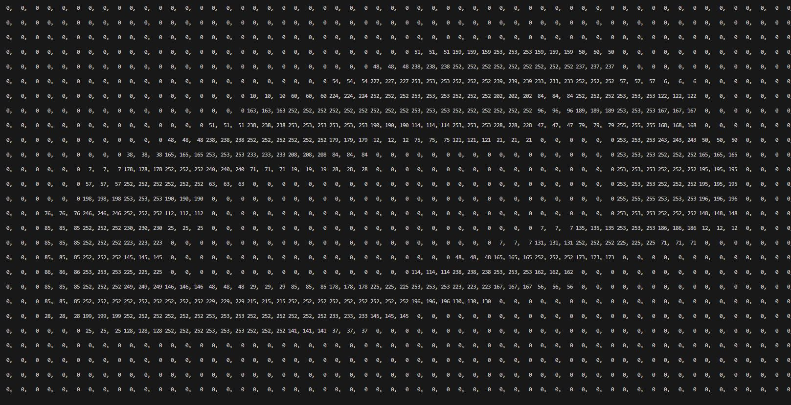
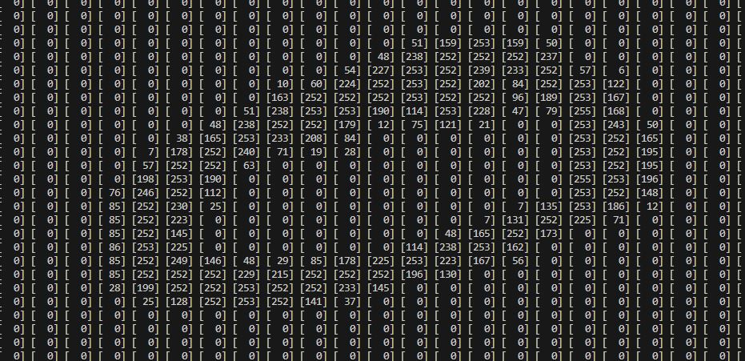
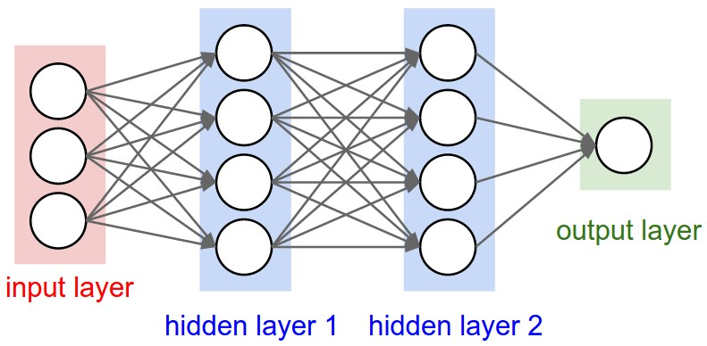

# Handwritten-Digit-Classifier
Bult a neural network from scratch in C to classify handwritten digits (MNIST), without ML frameworks. 

## Why? 
A lot of code is written by AI and plenty of people and even students can not explain what the AI wrote or how their program works. For that exact reason, that is why I decided to learn the foundations of neural networks (NN) by myself with little to zero use of AI. I

This project has brought together what I have learned in class from writing comments that explain each line to structs, to pointers that point to the next layer in the network. It is hard knowing that every little function I am writing like the ReLU function is just a easy python library waiting to be called.  

This project is using the MNIST dataset to develop and train a neural network with little to no help from any AI model/ agent. This is to help teach the foundations of neural networks in a challenging language aka C. 

## How it Works

Each image is 28 * 28 and handwritten from the MNIST dataset.

My first thought was to take the sRGB values, but then I realized that that would increase my input neuron count and make things way to complex. 

Instead I stripped away the color and turned the pixel array into a greyscale pixel array. This meant that each has a value from 0 to 254.

Since each image has 784 pixels (2D array of 28 * 28 pixels) I flattened the 2D array and put it into a single 1D greyscale array. 

This array will be used for my 784 neuron input layer into the network. 

## Training
The training happens in four stages: 

1. **Forward Pass** takes the 784 greyscale pixel array divides it by 255. Then computes each neuron's weighted sum plus bias (z) layer by layer. ReLU is used layer by layer as the activation function. Finally, it applies a softmax distribution over the 10 digits. 

2. **Cross Entropy Loss** measures how far off the network prediction was from the correct digit. I chose this method since the answer is categorical (has to be one of the 10 digits) compared to diverse and spread out. 

3. **Backpropagation** goes backwards from the output and computes the loss. Comparing the correct value to the predicted output by computing how much each neruon contributed to that error. This changes the delta value that lives within the Neuron struct. 

4. **Gradient Descent** changes every weight and bias slightly in the direction that reduces the loss. The learning rate parameter determines how big each step is. 

## Next Steps... 
In the [article](https://www.lyzr.ai/glossaries/batch-size/) they used 10,000 images, with a batch size of 32. Given the massive MNIST dataset (60,000 PNGs) I doubled it by 6. This means that per batch size will consist of 192 random PNGs [0-9] and will total about 312 total batches. 

